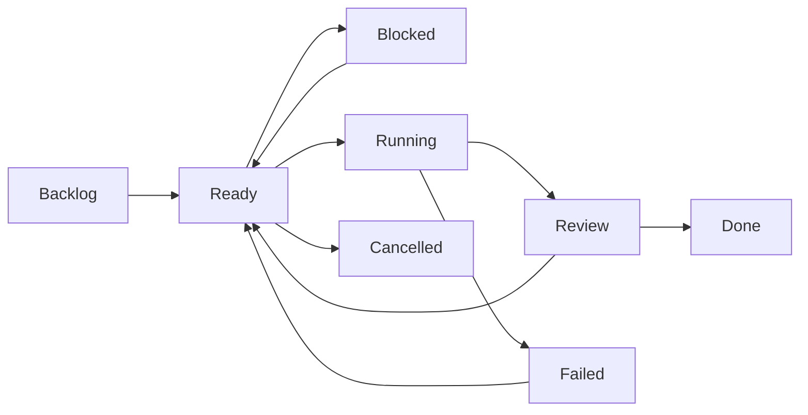

# Task storage and format

MyQue stores queue state under `.myque/` in the repository root.

```txt
.myque/
  config.toml
  tasks/
    task-2026-06-22-001.md
  runs/
    run-2026-06-22-001.toml
```

Task status is metadata, not a directory name. Stable task paths keep dependency links, editor tabs, Git history, and external tooling from breaking when a card moves between lifecycle states.

## Task files

Each task is a Markdown file with TOML frontmatter delimited by `+++`.

```md
+++
id = "task-2026-06-22-001"
title = "Add retry policy to sync worker"
status = "ready"
priority = 2
order = 1000
labels = ["backend", "safe-auto"]
agent = "coder"
backend = "noop"
depends_on = []
allowed_auto_dispatch = true
attempts = 0
max_attempts = 2
created_at = "2026-06-22T12:00:00Z"
updated_at = "2026-06-22T12:00:00Z"
+++

## Goal

Add retry policy to the sync worker.

## Context

Current worker fails permanently on transient network errors.

## Constraints

Do not change the auth storage format.

## Acceptance

- Retries transient errors up to 3 times.
- Does not retry validation errors.
- Existing tests pass.
- New retry behavior is covered by tests.

## Files

- `src/sync/worker.*`

## Notes

Any extra context for the agent.
```

## Required frontmatter

| Field | Meaning |
| --- | --- |
| `id` | Stable unique task ID. Timestamp-based IDs are readable and scriptable. |
| `title` | Short card title shown in board and list output. |
| `status` | One lifecycle status. |
| `priority` | Lower values sort before higher values. |
| `order` | Stable manual ordering key inside a status column. |
| `labels` | Human and policy labels. |
| `agent` | Logical agent role, such as `coder`, `reviewer`, `designer`, or `researcher`. |
| `backend` | Backend adapter name, such as `noop` or `shell`. |
| `depends_on` | Task IDs that must be `done` before this task can dispatch. |
| `allowed_auto_dispatch` | Per-task opt-in for automatic dispatch. |
| `attempts` | Dispatch attempts already made. |
| `max_attempts` | Maximum dispatch attempts before the task is skipped. |
| `created_at` | Creation timestamp. |
| `updated_at` | Last metadata or content mutation timestamp. |

## Markdown sections

Dispatchable tasks should include these sections:

```md
## Goal
## Context
## Constraints
## Acceptance
```

Optional sections:

```md
## Files
## Notes
```

When `allowed_auto_dispatch = true`, MyQue requires a non-empty `## Acceptance` section by default.

Agents and workers should prefer `myque edit`, `myque label`, `myque deps`, and `myque section` for task mutations. These commands preserve frontmatter/body structure, update `updated_at`, and run validation instead of relying on manual file edits.

## Lifecycle statuses

| Status | Meaning |
| --- | --- |
| `backlog` | Captured but not ready for an agent. |
| `ready` | Complete enough to dispatch if policy allows it. |
| `blocked` | Waiting on dependencies or missing context. |
| `running` | Assigned to an agent backend. |
| `review` | Agent claims the task is complete; human or verifier should inspect. |
| `done` | Accepted as complete. |
| `failed` | Attempt failed and needs intervention or retry. |
| `cancelled` | Intentionally abandoned. |

Default lifecycle:



Rules:

- Agents should move `running` tasks to `review`, not `done`, unless policy explicitly allows direct completion.
- `done` dependencies unblock downstream tasks.
- `review` does not unblock dependencies by default.
- `failed` tasks can be retried by moving them back to `ready` if attempts remain.

## Config

`.myque/config.toml` controls dispatch policy and backend mapping.

```toml
default_backend = "noop"
max_parallel = 1

[policy]
auto_dispatch = true
require_allowed_label = true
allowed_labels = ["safe-auto"]
blocked_labels = ["dangerous", "needs-human", "destructive"]
require_acceptance_section = true
require_allowed_auto_dispatch = true
max_attempts_default = 2
agents_may_mark_done = false

[agents.coder]
backend = "noop"

[agents.reviewer]
backend = "noop"
```

Shell backend example:

```toml
[backends.shell]
kind = "shell"

[agents.coder]
backend = "shell"
command = "codex run --task-file {task_file}"
```
